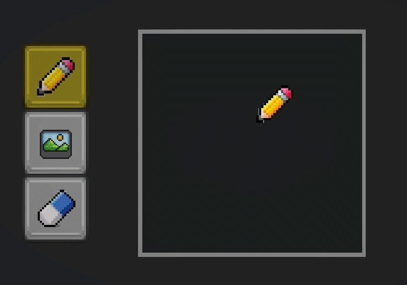

# SandFall

A falling-sand pixel simulation for Unity. Drop it into any project and get a fully interactive sand canvas with a brush system, sprite stamping, and a clean API.



## Requirements

- Unity 6000.0+
- Input System `1.19.0+`
- UI (`com.unity.ugui`) `2.0.0+`

## Installation

### Via Git URL (UPM)

1. Open **Window → Package Manager**
2. Click **+** → **Add package from git URL…**
3. Enter:
   ```
   https://github.com/bilalemregurkan/SandFall.git?path=Assets/!SandSystem
   ```

### Via local path

1. Clone or download the repo
2. Open **Window → Package Manager**
3. Click **+** → **Add package from disk…**
4. Select `Assets/!SandSystem/package.json`

## Quick Start

1. Create a **Canvas** with a `RawImage` in your scene.
2. Add the **SandSetup** prefab (under `Prefab/`) to the scene, or add `SandFallController` + `SandRenderer` to a GameObject manually.
3. Assign the `RawImage` to `SandFallController.displayTarget`.
4. Create a `SandSetting` asset (**Assets → Create → SandFall → SandSetting**) and assign it to the controller.
5. Press Play — the simulation runs automatically via `FixedUpdate`.

To interact at runtime, attach `SandFallExample` to any GameObject, wire up the controller, and left-click on the canvas to spawn sand. Press **Space** to clear.

## Architecture

```
SandFallController        MonoBehaviour — owns the simulation loop
  └─ SandSimulation       Pure C# — grid stepping logic
       └─ SandGrid        2-D array of PixelContainers
SandRenderer              MonoBehaviour — writes grid to a Texture2D
SandSetting               ScriptableObject — grid size, step rate, colors
```

### Brush system

| Type | Class | Behaviour |
|------|-------|-----------|
| Freeform | `FreeformBrush` | Paint while held |
| Erase | `EraseBrush` | Clear pixels in radius |
| Sprite | `SpriteBrush` | Stamp a pixel-art sprite on click |

Create a `BrushSetting` asset (**Assets → Create → SandFall → BrushSetting**) to configure each brush and assign it via `SandFallExample.SetActiveSetting()`.

## API

```csharp
// Spawn a colored pixel
controller.Spawn(x, y, color);

// Clear the entire grid
controller.Clear();

// Toggle diagonal spread (sand pile slope)
controller.EnableDiagonalSpread = false;

// Access the raw grid
SandGrid grid = controller.Simulation.Grid;
PixelContainer cell = grid.Get(x, y);
```

## License

MIT
